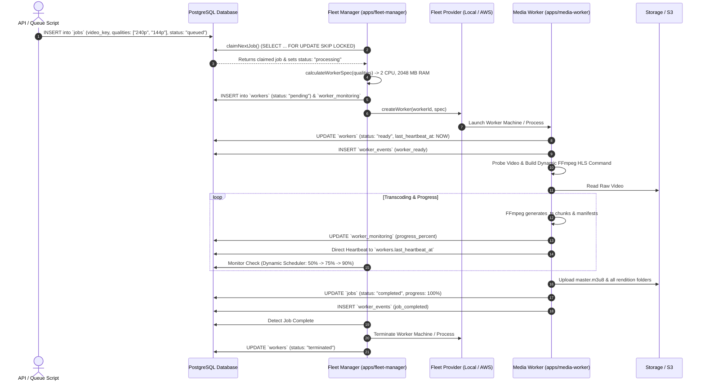

# Fleet Manager & Video Transcoding Pipeline Documentation

This document provides complete architectural, operational, and development documentation for the **VeoLMS Ephemeral Video Transcoding Fleet** and **Autonomous Media Worker Engine**.

---

## 1. High-Level Architecture

The system decouples the **Control Plane** (Fleet Manager) from the **Worker Plane** (Media Worker):

```
 ┌─────────────────────────────────────────────────────────────┐
 │                      API / Producer                         │
 │     Queues transcode job with target qualities array        │
 └──────────────────────────────┬──────────────────────────────┘
                                │
                                ▼
 ┌─────────────────────────────────────────────────────────────┐
 │                   PostgreSQL `jobs` Table                   │
 │       ACID Queue with SELECT ... FOR UPDATE SKIP LOCKED      │
 └──────────────────────────────┬──────────────────────────────┘
                                │ (Picks queued job)
                                ▼
 ┌─────────────────────────────────────────────────────────────┐
 │                     apps/fleet-manager                      │
 │                        Control Plane                        │
 │   - Job Manager (Atomic claim, status transitions)          │
 │   - Worker Manager (Calculates compute specs)               │
 │   - Dynamic Monitoring Scheduler (Backoff / Polling)        │
 │   - Fleet Monitor (Heartbeat timeout checker)               │
 └──────────────────────────────┬──────────────────────────────┘
                                │
                    implements FleetProvider
                                │
            ┌───────────────────┴───────────────────┐
            │                                       │
            ▼                                       ▼
 ┌─────────────────────┐                 ┌─────────────────────┐
 │    Local Provider   │                 │     AWS Provider    │
 │ (Local dev / test)  │                 │  (Bare EC2 Graviton)│
 └──────────┬──────────┘                 └──────────┬──────────┘
            │                                       │
            └───────────────────┬───────────────────┘
                                │ provisions / spawns
                                ▼
 ┌─────────────────────────────────────────────────────────────┐
 │                      apps/media-worker                      │
 │                        Worker Plane                         │
 │   - Autonomous Worker (Direct DB heartbeats & events)       │
 │   - FFmpeg Multi-Rendition HLS Command Builder              │
 │   - Real-Time Stdout Progress Parser                        │
 │   - S3 / Local Manifest & Chunk Synchronizer                │
 └──────────────────────────────┬──────────────────────────────┘
                                │
            ┌───────────────────┴───────────────────┐
            ▼                                       ▼
 ┌─────────────────────┐                 ┌─────────────────────┐
 │     PostgreSQL      │                 │  S3 / Local Storage │
 │ - Direct Heartbeats │                 │ - master.m3u8       │
 │ - Progress (0-100%) │                 │ - 144p, 240p, ...   │
 │ - Audit Events      │                 │ - .ts Segment Chunks│
 └─────────────────────┘                 └─────────────────────┘
```

---

## 2. Monorepo Package Breakdown

| Package / App                      | Path                                                                | Responsibility                                                                                                                                                                                                       |
| :--------------------------------- | :------------------------------------------------------------------ | :------------------------------------------------------------------------------------------------------------------------------------------------------------------------------------------------------------------- |
| **`@veolms/fleet-types`**          | [`packages/fleet-types`](../packages/fleet-types)                   | Zero-`any` strict TypeScript contracts, Zod schemas, quality profiles (`VideoQualityLevel`), and hardware specs.                                                                                                     |
| **`@veolms/database`**             | [`packages/database`](../packages/database)                         | Kysely database client, migration [`007-create-fleet-manager-tables.ts`](../packages/database/migrations/007-create-fleet-manager-tables.ts) with `video_jobs`, `workers`, `worker_monitoring`, and `worker_events`. |
| **`@veolms/fleet-provider-local`** | [`packages/fleet-provider-local`](../packages/fleet-provider-local) | Manages local Node.js child processes with PID tracking and stdout/stderr prefix streaming.                                                                                                                          |
| **`@veolms/fleet-provider-aws`**   | [`packages/fleet-provider-aws`](../packages/fleet-provider-aws)     | AWS EC2 provider with Graviton arm64/x86 instance type selector and Debian 14 UserData bootstrapper.                                                                                                                 |
| **`apps/fleet-manager`**           | [`apps/fleet-manager`](../apps/fleet-manager)                       | Control plane engine, atomic queue claim loop, dynamic monitoring scheduler, CLI diagnostics, and zombie worker pruner.                                                                                              |
| **`apps/media-worker`**            | [`apps/media-worker`](../apps/media-worker)                         | Autonomous transcode engine running FFmpeg, generating multi-quality HLS streams, direct heartbeats, and S3 uploads.                                                                                                 |

---

## 3. Step-by-Step Lifecycle



---

## 4. Why Native PostgreSQL Queue (`FOR UPDATE SKIP LOCKED`)?

Instead of adding external queue dependencies (`pg-boss`, `BullMQ`, `Redis`), VeoLMS uses PostgreSQL's native atomic concurrency primitive:

```typescript
// apps/fleet-manager/src/core/job-manager.ts
const row = await trx
  .selectFrom("jobs")
  .selectAll()
  .where("status", "=", "queued")
  .orderBy("created_at", "asc")
  .limit(1)
  .forUpdate() // Locks row during transaction
  .skipLocked() // Skips rows locked by other daemon instances
  .executeTakeFirst();
```

### Benefits:

1. **Zero Race Conditions**: If multiple Fleet Manager instances run concurrently, each acquires a distinct job without collisions or blocking.
2. **ACID Consistency**: Job creation, lesson metadata, and transcode requirements exist within the same PostgreSQL transactions.
3. **Deep Relational Joins**: `jobs` links directly to `workers`, `worker_monitoring`, and `worker_events` via foreign keys.

---

## 5. Quality Profiles & Dynamic FFmpeg Engine

When a job is queued, the caller specifies an array of desired qualities:

```typescript
qualities: ["1080p", "720p", "480p", "240p", "144p"];
```

### Supported Resolutions & Profiles:

| Quality           | Resolution         | Video Bitrate | Audio Bitrate | Max Framerate |
| :---------------- | :----------------- | :------------ | :------------ | :------------ |
| **`2160p` (4K)**  | $3840 \times 2160$ | 14,000 kbps   | 192 kbps      | 60 fps        |
| **`1440p` (2K)**  | $2560 \times 1440$ | 8,000 kbps    | 192 kbps      | 60 fps        |
| **`1080p` (FHD)** | $1920 \times 1080$ | 4,500 kbps    | 128 kbps      | 60 fps        |
| **`720p` (HD)**   | $1280 \times 720$  | 2,400 kbps    | 128 kbps      | 30 fps        |
| **`480p` (SD)**   | $854 \times 480$   | 1,200 kbps    | 96 kbps       | 30 fps        |
| **`360p`**        | $640 \times 360$   | 800 kbps      | 96 kbps       | 30 fps        |
| **`240p`**        | $426 \times 240$   | 400 kbps      | 64 kbps       | 30 fps        |
| **`144p`**        | $256 \times 144$   | 200 kbps      | 48 kbps       | 30 fps        |

### Safety Guardrail:

The FFmpeg command builder probes the source video dimensions. If a source video is $720\text{p}$, requested qualities higher than $720\text{p}$ (such as $1080\text{p}$ or $4\text{K}$) are automatically filtered out to prevent upscaling artifacts and wasted compute.

---

## 6. Generated Output Structure

All generated files conform to the standard HLS adaptive bitrate format:

```text
s3-bucket/output/<video-id>/
├── master.m3u8                # Adaptive bitrate master playlist
├── 144p/
│   ├── 144p.m3u8              # 144p stream index manifest
│   ├── segment_000.ts         # 4-second MPEG-TS chunks
│   └── ...
└── 240p/
    ├── 240p.m3u8              # 240p stream index manifest
    ├── segment_000.ts         # 4-second MPEG-TS chunks
    └── ...
```

### Master Playlist Example (`master.m3u8`):

```m3u8
#EXTM3U
#EXT-X-VERSION:3

#EXT-X-STREAM-INF:BANDWIDTH=464000,RESOLUTION=426x240
240p/240p.m3u8

#EXT-X-STREAM-INF:BANDWIDTH=248000,RESOLUTION=256x144
144p/144p.m3u8
```

---

## 7. Dynamic Monitoring Scheduler & EventBridge Triggers

Rather than constant naive polling, Fleet Manager uses a dynamic progress-aware algorithm:

1. **Initial Check**: Scheduled at **$50\%$** of estimated job duration.
2. **Intermediate Checks**: When progress is reported (e.g. $60\%$), calculates remaining time and checks at the halfway point of remaining work.
3. **Clamping**: Near completion ($\ge 99\%$), check intervals tighten to the minimum interval (`MIN_CHECK_INTERVAL_SECONDS`, default 15s).
4. **Heartbeat Timeout**: If a worker fails to write a direct heartbeat within `HEARTBEAT_TIMEOUT_SECONDS` (default: 90s), Fleet Manager marks it `failed` and re-queues the job.
5. **AWS EventBridge Scheduler (Serverless)**:
   - Evaluates $\min(\text{next\_check\_at})$ across all active workers.
   - Upserts a single one-shot schedule named `veolms-fleet-next-check` in AWS EventBridge Scheduler targeting the Lambda at that exact timestamp (`at(YYYY-MM-DDTHH:mm:ss)`).
   - Automatically deletes the schedule when all workers finish, guaranteeing **zero idle invocations**.

---

## 8. Two-Way State Reconciliation

Fleet Manager actively reconciles database state with real cloud provider instances on every tick and serverless invocation:

1. **Spot Interruption & Worker Crash Recovery**:
   - If a DB worker is in `provisioning`, `starting`, `ready`, or `processing`, but its EC2 instance is terminated/missing in AWS (past a 30s launch grace period):
   - The worker is marked `failed` with event `spot_interrupted`.
   - The job has its `attempts` incremented and is automatically reset to `queued` if `attempts < max_attempts`.

2. **Orphaned Cloud Instances (Zombie Cleanup)**:
   - If an EC2 instance tagged with `ManagedBy: veolms-fleet-manager` is running in AWS without a matching active worker in the database (older than 3 minutes):
   - Fleet Manager terminates the instance via `provider.terminateWorker()` and logs `orphan_instance_terminated`.

3. **Storage Output Verification**:
   - When a job reaches 100% progress or is marked completed, Fleet Manager verifies that the target `master.m3u8` playlist exists in S3 (non-zero size) before finalizing `completed` status.

---

## 9. CLI & Diagnostic Commands

The Fleet Manager provides built-in operational CLI commands:

```bash
# 1. Run the continuous Fleet Manager daemon
pnpm fleet run

# 2. Queue a video transcoding job
pnpm fleet queue my-video.mp4 --qualities=1080p,720p,480p --prefix=transcoded/my-video/

# 3. View real-time Fleet Health Summary
pnpm fleet health

# 4. Inspect timeline and audit events for a specific job
pnpm fleet status <JOB_ID>

# 5. List active and recent workers
pnpm fleet workers

# 6. Prune dead/zombie worker processes
pnpm fleet prune

# 7. Select active provider (AWS / Local)
pnpm fleet provider

# 8. Interactive AWS Infrastructure provisioning
pnpm fleet infra

# 9. Tear down AWS infrastructure
pnpm fleet destroy
```

---

## 10. Verification & Code Quality

- **Zero `any` Types**: Verified via `pnpm typecheck` across all monorepo packages.
- **Automated Test Suite**: `pnpm test` (70+ unit and simulation tests passing across contracts, fleet-types, fleet-provider-aws, and fleet-manager).
